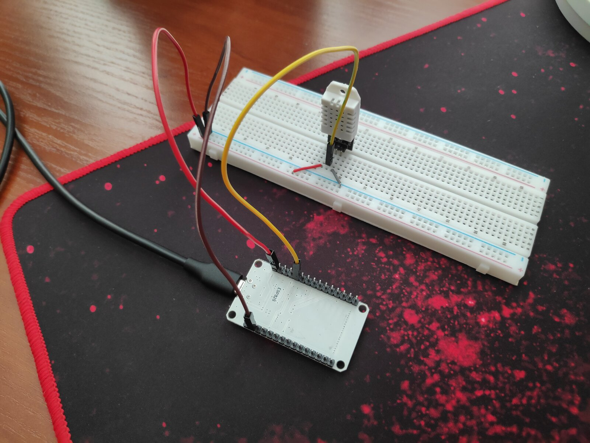

# ESP32 IoT

A small IoT project based on ESP32 and MicroPython.

The ESP32 connects to Wi-Fi, reads data from a DHT22 temperature and humidity sensor, and exposes the data through a simple HTTP REST API.

## Hardware



- ESP32-WROOM-32 DevKit V1
- DHT22 temperature and humidity sensor
- Breadboard
- Jumper wires
- USB cable

## Configuration

config.py contains public project configuration:

```bash
DHT22_PIN = 4
```

Wi-Fi credentials are stored separately in config_private.py:

```bash
WIFI_SSID = "YOUR_WIFI_NAME"
WIFI_PASSWORD = "YOUR_WIFI_PASSWORD"
```

## Development machine

Install mpremote in a Python virtual environment:

```bash
python3 -m venv .venv
source .venv/bin/activate
pip install mpremote
```

Check the installation:

```bash
mpremote --version
```

## Finding the ESP32 serial port

Connect the ESP32 to the computer via USB and run:

```bash
ls /dev/ttyUSB* /dev/ttyACM* 2>/dev/null
```

For example:

```bash
/dev/ttyUSB0
```

The upload and monitor scripts currently use /dev/ttyUSB0.

Uploading the project

Make sure the ESP32 is connected and run:

```bash
./scripts/upload.sh
```

The script uploads the project files to the ESP32.

## Monitoring the ESP32

Run:

```bash
./scripts/monitor.sh
```

The ESP32 will reboot and the serial monitor will show its output.

## VS Code

The project contains VS Code tasks for common development operations.

Open:

Terminal → Run Task

Available tasks include:

- Upload project
- Monitor ESP32
- Upload & Monitor

Upload & Monitor uploads the project and then starts the serial monitor.

## REST API

The ESP32 provides a simple HTTP API.

Health check  
GET /

Sensor data  
GET /api/sensors

System information  
GET /api/system

## Example of usage

```bash
curl http://192.168.1.61/
curl http://192.168.1.61/api/system
curl http://192.168.1.61/api/sensors
```

## License

MIT
